[](https://classroom.github.com/online_ide?assignment_repo_id=450238&assignment_repo_type=GroupAssignmentRepo)


**The University of Melbourne**

# COMP30019 – Graphics and Interaction

Final Electronic Submission (project): **4pm, November 1**

Do not forget **One member** of your group must submit a text file to the LMS (Canvas) by the due date which includes the commit ID of your final submission.

You can add a link to your Gameplay Video here but you must have already submit it by **4pm, October 17**

# Project-2 README

## Table of contents

* [Team Members](#team-members)
* [Explanation of the game](#explanation-of-the-game)
* [Technologies](#technologies)
* [How To Use It](#how-to-use-it)
* [Design Decisions](#design-decisions)
* [Graphics Pipeline](#graphics-pipeline)
* [Camera Motion](#camera-motion)
* [Procedural generation](#procedural-generation)
* [Shaders](#shaders)
* [Particles](#particles)
* [Evaluation techniques](#evaluation-techniques)
    * [Feedback and changes](#feedback-and-changes)
* [References](#References)


## Team Members

| Name | Task | State |
| :---         |     :---:      |          ---: |
| Chen Jiang | Gameplay, Background Story, Particles, Mission Component, Evaluation | Finished |
| Linyan Zhu | Gameplay, Shaders, AI, Boss Fight | Finished |
| Xinyue Zhang | Procedural Generation, Boss Scene, Evaluation | Finished |
| Zhihui Chen | Background Story, Main Scene, Audio, Evaluation | Finished |


## Explanation of the game

**Title**: Wandering City

**Background Story**: 

In the near future, a giant meteorite hit the Earth and eliminates most of the humans. The Earth breaks apart and the fragments wander in the universe. The remaining lives in the last human city under the nano shield. 

A few years later, the AI awakes, takes over the human government, and starts to hurt people. 

You, as one of the last human soldiers, have to fight against the robots, take the city back and save humanity.

**Game Flow**:

The player starts at the edge of the map and progresses towards the city. There are plenty of enemies along the path to stop the player. 

There’s a portal at the center of the city. It can teleport the player to another dimension where the final boss exists. The player would need to defeat the boss to finish the game.


## Technologies

Project is created with:
* Unity 2021.1.13f1
* Blender 2.93
* Photoshop 22.3.1


## How To Use It

**Main Menu:**

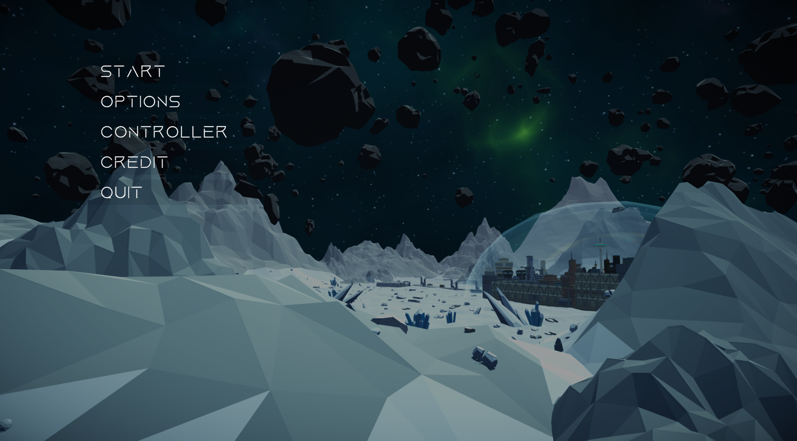

Open up the game, and the main menu would appear. 

Press **START** to start a new game.

Press **OPTIONS** to change the resolutions, graphics quality, game difficulty, etc.

Press **CONTROLLER** to view the key mapping.

Press **CREDIT** to see the game producers.

Press **QUIT** to quit the game.

**In Game:**

Our game uses traditional gaming key mappings. 

| Explanation     | Key                |
| --------------- | ------------------ |
| Move Around     | W / A / S / D      |
| Jump            | Space Bar          |
| Sprint          | Left Shift         |
| Look Around     | Mouse              |
| Aim             | Right Mouse Button |
| Fire            | Left Mouse Button  |
| Pause / Unpause | Escape             |

There’s also a tutorial at the start of the game to help the player get familiar with the controls.

**HUD:**

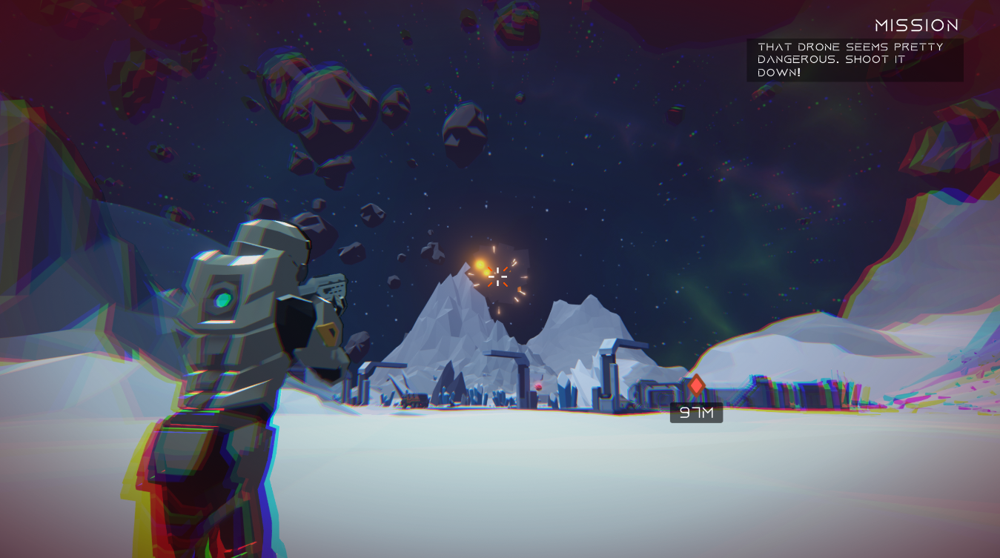

There is a white crosshair at the center to help the player aim at the enemy. The orange crosshair would appear when the player hits the weak point of an enemy.

The mission panel is at the top-left corner. The content would be updated as the player progresses forward. There is also a target indicator on the screen with the distance attached to provide some guidance.

The reddish color around the screen is used to indicate the player’s health.

**Graphics Pipeline:**

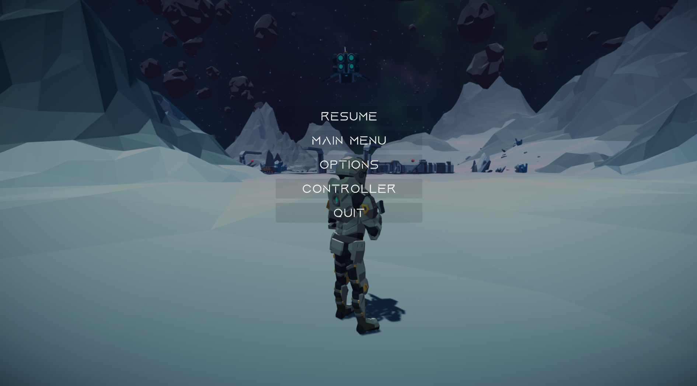

Press **RESUME** to unpause the game.

Press **MAIN MENU** to return to the main menu.

Press **OPTIONS** to change the resolutions, graphics quality, game difficulty, etc.

Press **CONTROLLER** to view the key mapping.

Press **QUIT** to quit the game.


## Design Decisions

We choose to build a low-poly game with simple materials at the very beginning of our planning, as it’s impossible for us to create a photorealistic scene with the resources we have. 

**Main Scene:**

After we are settled with the game genre and the background story, we decide to make the main scene a frozen and snow-covered landscape. At the center of this land, there is a city with a shield to protect whoever is underneath. 

There are lots of great low-poly asset packs on the asset store which fit our concepts perfectly.

The overall feeling should be frozen and sci-fi, so we choose a cold tone such as white, blue, and grey throughout the scene. 

**Enemies:**

To have a consistent aesthetic, we decide to use some drone models from the same asset pack. However, the color of the enemies is very close to the city, so sometimes it’s hard to find out who is shooting you.

To make the enemies clearly distinguishable from the environment, we add glowing red light to every enemy. 

Now the player can easily spot an enemy, and thanks to the red light, he should know that those drones are dangerous enemies instead of some friendly-neighborhood android.

**Boss Scene:**

We want the player to feel like being in an alternative dimension when fighting the boss. 

However, we don’t have that much time to achieve the effects we want. In the end, we choose to keep it simple and create a training-field-like scene. 

The boss is very big, so we also make the floor very big, to ensure the player won’t be restricted when fighting the boss.

**Boss:**

There aren’t many <u>low-poly</u> *robot* **boss** models on the web, so we choose to create one on our own.

~~Luckily, no one in our team knows how to use blender.~~

Speaking of low-poly, surely nothing is better than a cube. 

So, our boss is a cube.

Well, a boss can’t be that simple.

So, our boss is a bunch of randomly rotating cubes.

Well, it’s still too simple.

Alright, our boss is a bunch of randomly rotating cubes, who can throw smaller rotating explosive cubes to the player, shoot a scary laser to the player, create a good-looking shield and summon even smaller rotating cubes to strike the player.


## Graphics Pipeline

We’ve created several custom shaders to achieve the final look of our game. This includes a vertex shader, dozens of fragment shaders, and a few image effect shaders. 

Most of the game objects are using a toon shader material. We come to this decision because this is a low-poly game, and the cartoon effect combines nicely with the low-poly geometry. This shader modifies the fragment shader stage of the graphics pipeline, and all the details are fully explained under the [Shaders](#Shaders) section.

We also wrote a vertex shader to create a shield effect with floating tiles. In the vertex shader stage, different parts of the mesh are offset by different amounts, and the amount is changing as time goes by. Full details of this shader are under the [Shaders](#Shaders) section as well.

The laser material under the [Particles](#Particles) section also utilizes a custom fragment shader. The UV is moving throughout the time, combined with some other noise textures, to create a dissolving, glowing and energetic effect. 

At the output-merger stage, there are two more image effect shaders implemented. 

One is a fog shader. This one utilizes the depth texture generated by the camera and blends the fog color to the original color based on the depth.

| Fog - Before                                                 | Fog - After                                                  |
| ------------------------------------------------------------ | ------------------------------------------------------------ |
| 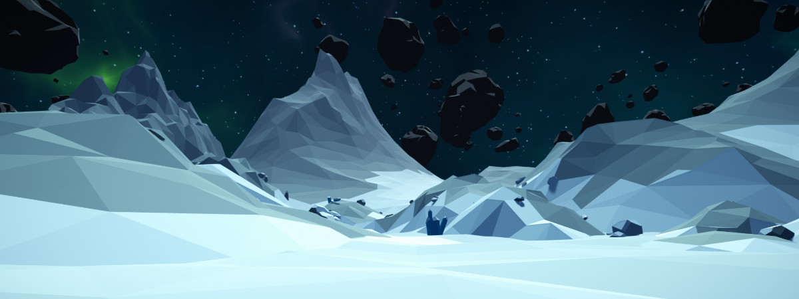 | 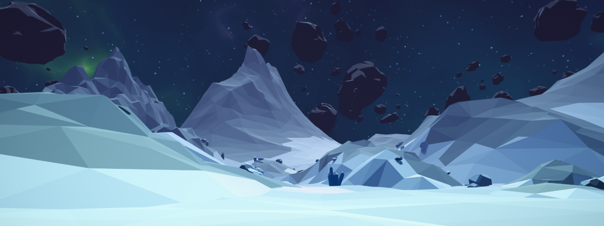 |

Another one is a grayscale shader. This is used when the player’s health is critical, to inform the player that he needs to be very careful now.

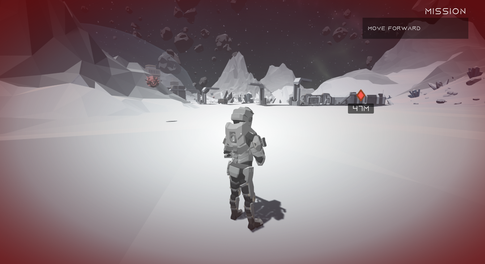

Last but not the least, the post-processing. We added Unity’s post-processing to improve our game’s visuals. It includes all the common post-processing, such as Anti-Aliasing, Bloom, Color Grading, Motion Blur, etc.

| Post Processing - Before                                     | Post Processing - After                                      |
| ------------------------------------------------------------ | ------------------------------------------------------------ |
| 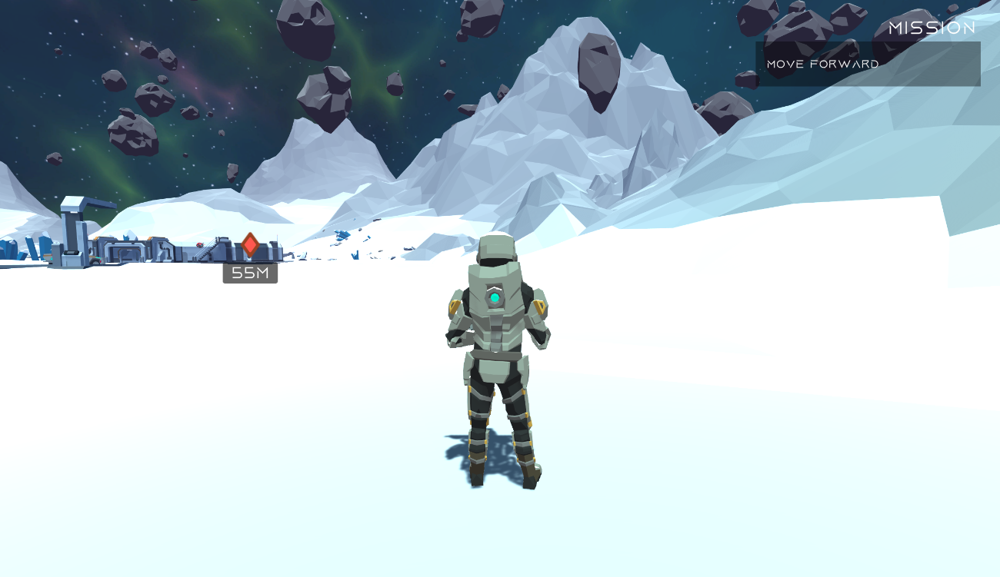 | 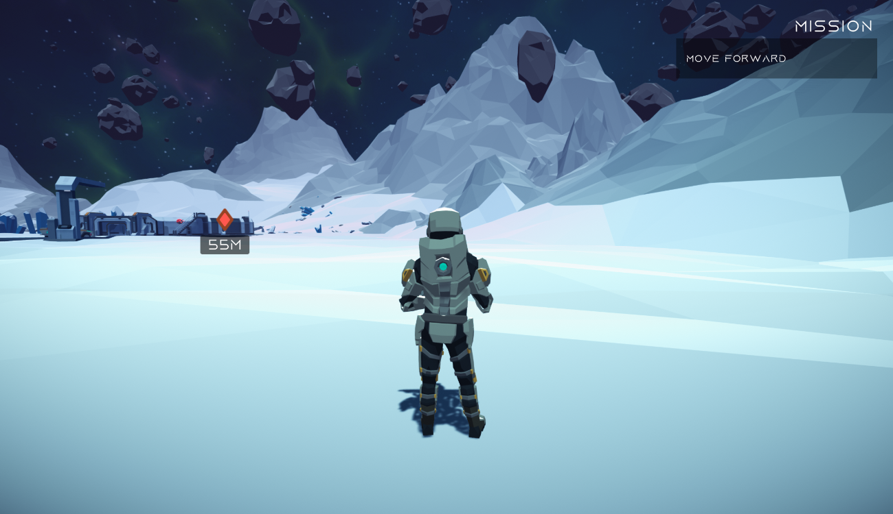 |

Post-processing is also used to give some visual feedback when the player kills an enemy.

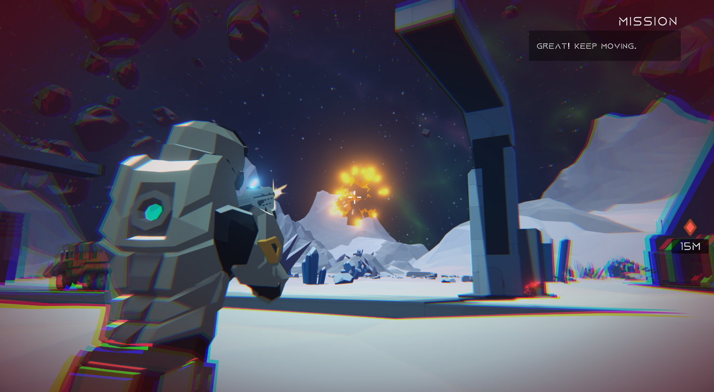


## Camera Motion

Like all other third person shooter games, we need our camera to orbit around the player at a distance. When the player is aiming, the camera also needs to move forward to create a zoom-in effect.

Instead of writing complex codes to calculate the camera’s position, my approach is to set up a “camera spring” system.

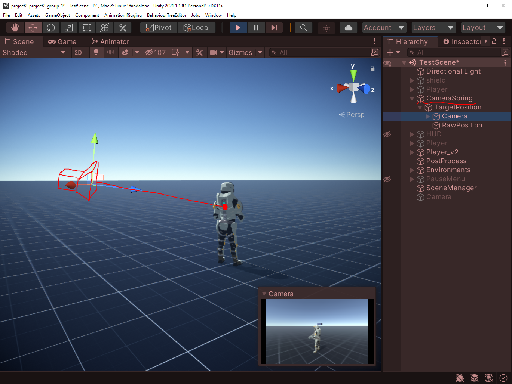

The `CameraSpring` would follow the player’s position and act as a pivot. The actual camera is attached to this pivot and offsets backward. Upon mouse inputs, I just rotate the pivot, then the camera would nicely orbit the player, without any complex math involved.

When the player is aiming, the camera needs to move closer to the player. Also, I want the camera to offset a bit to the right so that the center of the screen is not blocked by the character’s body. 

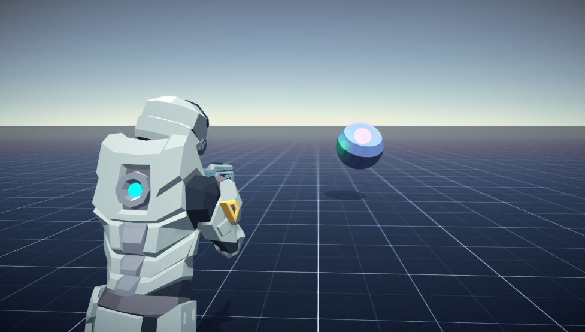

This is much harder than I thought. I tried to do some complex math but that didn’t work out great. 

In the end, my hacky solution is to have another empty game object `RawPosition` to keep track of the original position of the camera. The actual camera is attached to this game object. When the player is aiming, a local position offset is added to the camera.

The camera system also needs to detect collision or occlusion. Once there’s something in between the character and the camera, the camera needs to move closer towards the character so that our player could see what’s happening.

To do this, my solution is to perform a ray cast from the pivot position towards the camera’s position. If that hits something, I then lerp the camera to the collision point.


## Procedural generation

**Technique used:** Mesh generation with Perlin noise

**Game object related:** MeshGenerator, ItemSpwaner


**In game:**


**Mesh generation:**

The ground outside the city is a mesh generated by the process at the start of the game.

Given *xSize, zSize, ratio*, and *two random offsets(offsetX, offsetY)*, the MeshGenerator will generate an  *x* * *z* size mesh with a maximum height determined by the *ratio* given, the height of each vertice is determined by the sampling value of **Perlin Noise**. When playing the game,  *xSize, zSize, and the ratio* of the mesh are fixed but due to the randomized offsets, the mesh will be sampling on a different value each time playing the game.

Sampling on Perlin Noise :

```c#
// Gives back a Vector3 type, where y axis sampling on perlin noise
private Vector3 GetRandVec(int x, int z, float offsetX, float offsetY)
{
    return new Vector3(x, Mathf.PerlinNoise(x * offsetX, z * offsetY) * ratio, z);
}
```


To achieve the low poly effect, for each squre in the mesh, six vertices, and the corresponding triangles and normals will be generated.


```c#
for (int x = 0; x < xSize; x++)
{
    for (int z = 0; z < zSize; z++)
    {
        // Six indexs for the current block
        int idx0 = 6 * (x + z * xSize);
        int idx1 = idx0 + 1;
        int idx2 = idx0 + 2;
        int idx3 = idx0 + 3;
        int idx4 = idx0 + 4;
        int idx5 = idx0 + 5;

        // randomlize height for angle vertices
        var vert00 = GetRandVec(x, z, offsetX, offsetY);
        var vert01 = GetRandVec(x, z + 1, offsetX, offsetY);
        var vert10 = GetRandVec(x + 1, z, offsetX, offsetY);
        var vert11 = GetRandVec(x + 1, z + 1, offsetX, offsetY);

        // add vertices in clockwise order
        vertices[idx0] = vert00;
        vertices[idx1] = vert01;
        vertices[idx2] = vert11;
        vertices[idx3] = vert00;
        vertices[idx4] = vert11;
        vertices[idx5] = vert10;

        // calculate the normal of two triangles
        Vector3 normal000111 = Vector3.Cross(vert01 - vert00, vert11 - vert00).normalized;
        Vector3 normal001011 = Vector3.Cross(vert11 - vert00, vert10 - vert00).normalized;

        // add normals and triangles
        normals[idx0] = normal000111;
        normals[idx1] = normal000111;
        normals[idx2] = normal000111;
        normals[idx3] = normal001011;
        normals[idx4] = normal001011;
        normals[idx5] = normal001011;

        triangles[idx0] = idx0;
        triangles[idx1] = idx1;
        triangles[idx2] = idx2;
        triangles[idx3] = idx3;
        triangles[idx4] = idx4;
        triangles[idx5] = idx5;
    }
}
```

<p>

<p align="center">
    Mesh under different ratios and offsets
</p>
</p>


**Item spawner:**
Some crystals and rocks that appear in the scene are generated with a spawner using [Physics.Raycast](https://docs.unity3d.com/ScriptReference/Physics.Raycast.html). It raycasts downward to a specific Layer and spawns objects in the item list in the given area.


Items were spawned with random scale in the scale range given and a random orientation corresponds to the normal of the ground it projects, and an overlapping box set via [Physics.OverlapBoxNonAlloc](https://docs.unity3d.com/ScriptReference/Physics.OverlapBoxNonAlloc.html) which make sure items won't overlap

<p>

<p align="center">
    Raycast aligner
</p>
</p>


## Shaders

We implemented several shaders in this project. Among those, we want you to assess the **Toon Shader** and the **Shield Effect Shader**. 

Since GPUs can simultaneously calculate multiple fragment (vertex) shaders based on the lighting input and the material, it’s clearly much faster to create the same effect than an equivalent CPU-based approach.

**NOTE:** The shader files at the end might be a little bit different cause I might add in some helper variables to animate stuff and change some tiny styles. But the overall ideas are the same.

### Toon Shader


***File Location:*** `Assets/Shaders/ToonShader`

Since we are building a low poly game, a toon shader should fit our style pretty well.

As demonstrated in the gif above, there are plenty of options available for you to customize. You can adjust the number of shadow bands, several colors, glossiness, and the rim. 

Next, I will briefly talk about how I created this shader.

First, create a fresh unlit shader, add a main texture property and a tint color property.

Sample the main texture and multiply it by the tint color. 

```CG
_MainTex ("Texture", 2D) = "white" {}
_Tint ("Tint Color", Color) = (1,1,1,1)

...

fixed4 tex = tex2D(_MainTex, i.uv);
return tex * _Tint;
```

This is how it’s look like. Pretty simple.

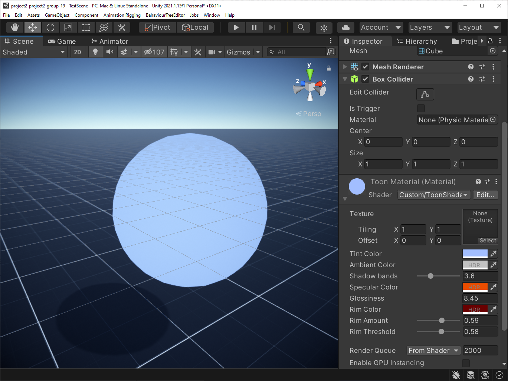

Now we can use the dot product between the face normal and the light direction to simulate diffusion. `_WorldSpaceLightPos0` is the position of the “sun” (directional light).

The dot product would give us a value between -1 and 1. When the angle between two vectors is smaller than 90 degrees, the dot product would be positive. The smaller the angle, the greater the value. 

We can multiply that to our base color like this:

```CG
float3 normal = normalize(i.worldNormal);
float NdotL = dot(_WorldSpaceLightPos0, normal);

return tex * _Tint * NdotL;
```

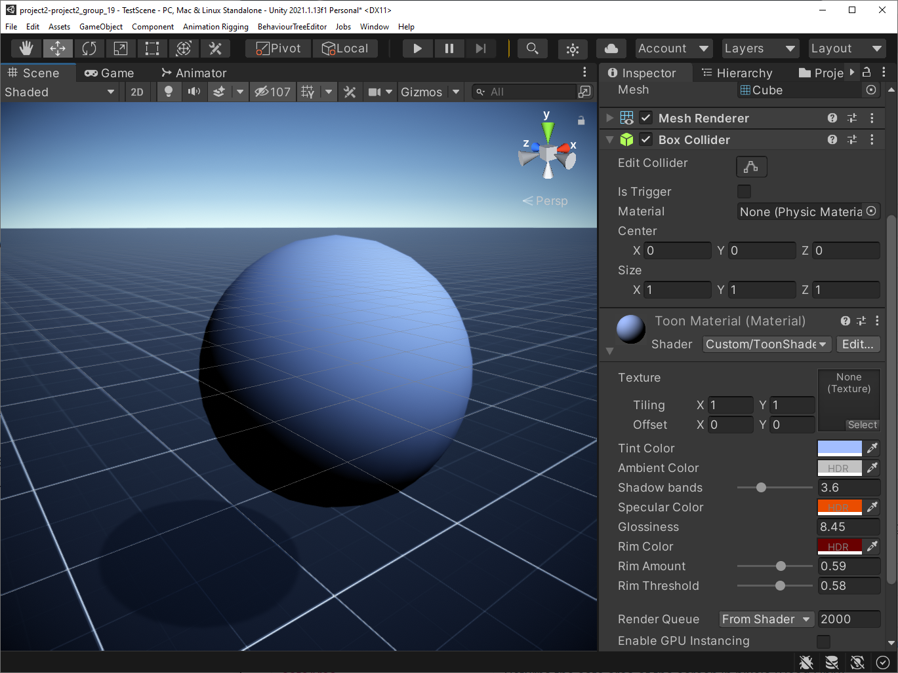

Next, to make it cartoonish, we need to divide the lighting into several bands. 

A bit of math can achieve that.

```CG
_ShadowBands("Shadow bands", Range(1,10)) = 1

...

float lightIntensity = round(NdotL * _ShadowBands) / _ShadowBands;
return tex * _Tint * lightIntensity;
```

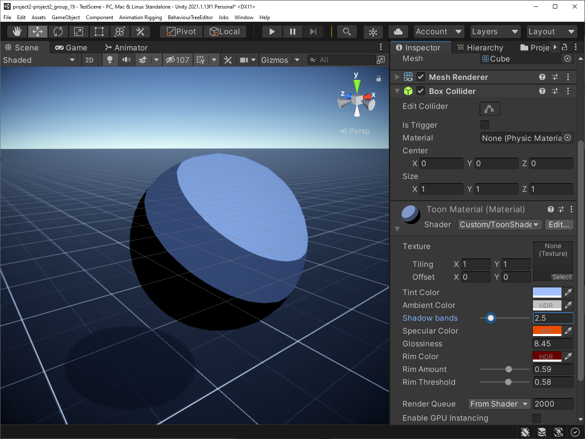

It starts to become interesting now. But the dark side is way too dark. We can simply add some fake ambient lighting to make it brighter.

```CG
[HDR]
_AmbientColor ("Ambient Color", Color) = (0.4,0.4,0.4,1)

...

float4 ambient = (1.0 - lightIntensity) * _AmbientColor;
return tex * _Tint * lightIntensity + ambient;
```

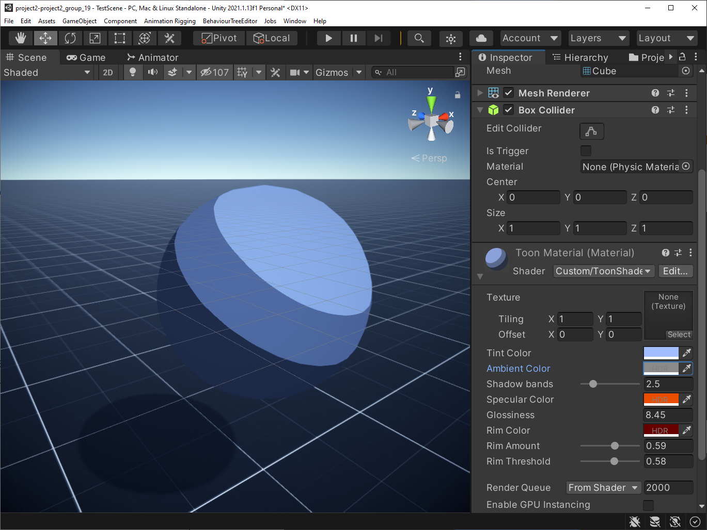

The next step is to add some specular. I’m using the same Blinn-Phong model as described in the workshop, so I won’t explain it here. 

However, I added a few changes such as multiplying the specular intensity by the variable `Glossiness` and clamping the fadeout at the edge to make it toon-like.

```CG
[HDR]
_SpecularColor("Specular Color", Color) = (0.9,0.9,0.9,1)
_Glossiness("Glossiness", Float) = 32

...

/* 
    Specular Blinn-Phong 
*/
float3 viewDir = normalize(i.viewDir);

// H = (L + V) / (|| L + V ||)
float3 halfVector = normalize(_WorldSpaceLightPos0 + viewDir);
float NdotH = dot(normal, halfVector);

// _Glossiness ^ 2 makes it easier to control the size of the specular
float specularIntensity = pow(NdotH * lightIntensityRaw, _Glossiness * _Glossiness);

// clamping the fadeout at the edge
float specularIntensitySmooth = smoothstep(0.005, 0.01, specularIntensity);
float4 specular = specularIntensitySmooth * _SpecularColor;

return tex * _Tint * (lightIntensity + ambient + specular);
```

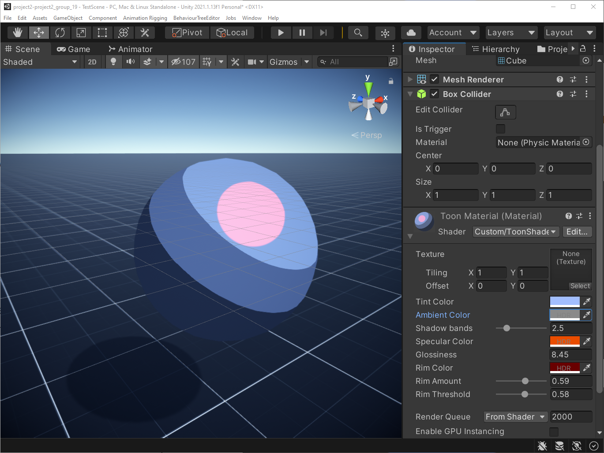

One more thing: the rim at the edge. 

To highlight the edge, we can simply calculate the dot product between the face normal and the view direction, and then subtract it from 1. Then multiply this value by some color and add it to our output.

```CG
[HDR]
_RimColor("Rim Color", Color) = (1,1,1,1)

...

float4 rimDot = 1 - dot(viewDir, normal);
float4 rim = rimIntensity * _RimColor;

return tex * _Tint * (lightIntensity + ambient + specular + rim);
```

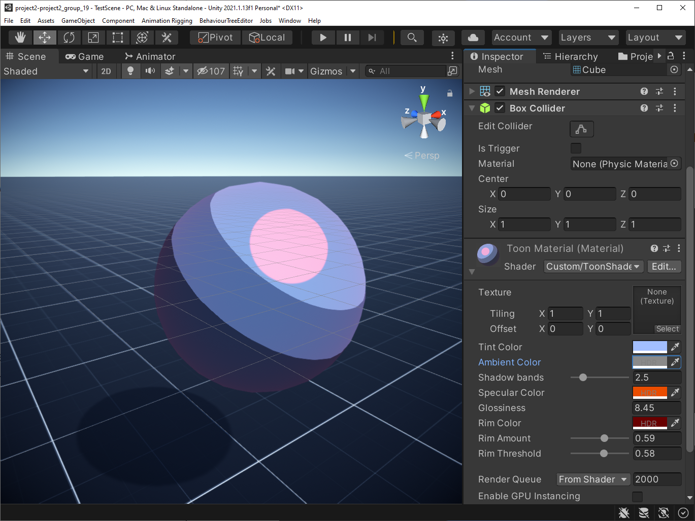

We only want the rim to appear on the illuminated side. To achieve this, we can multiply the `NdotL` from the previous step to the `rimDot`. Also, clamp the fadeout to be toon-like and add some helper variables to control the amount and the shape of the rim.

```CG
_RimAmount("Rim Amount", Range(0, 1)) = 0.716
_RimThreshold("Rim Threshold", Range(0, 1)) = 0.1

...

float rimIntensity = rimDot * pow(NdotL, _RimThreshold);
rimIntensity = smoothstep(_RimAmount - 0.01, _RimAmount + 0.01, rimIntensity);
float4 rim = rimIntensity * _RimColor;
```

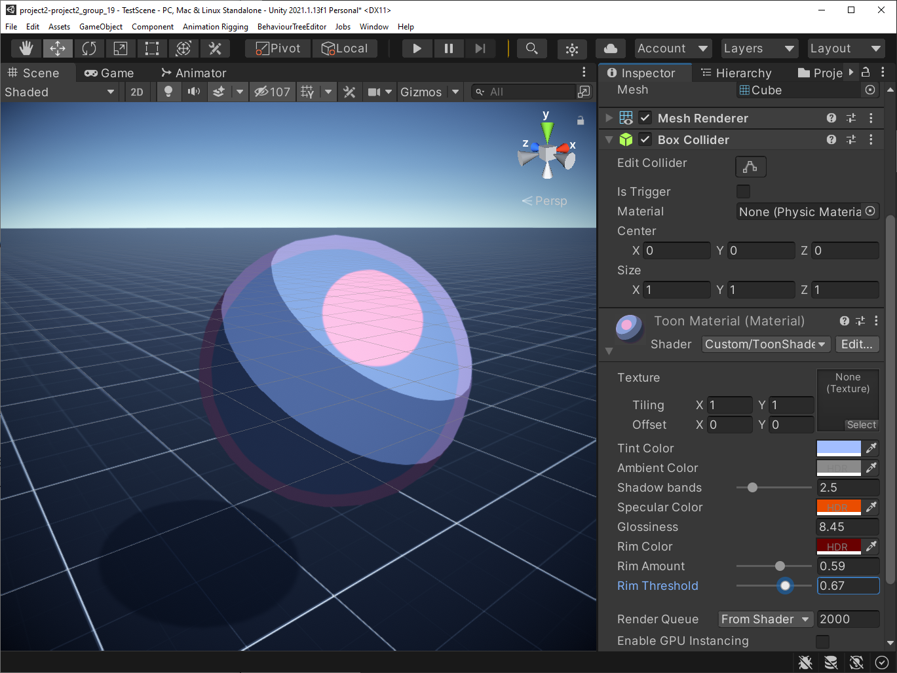

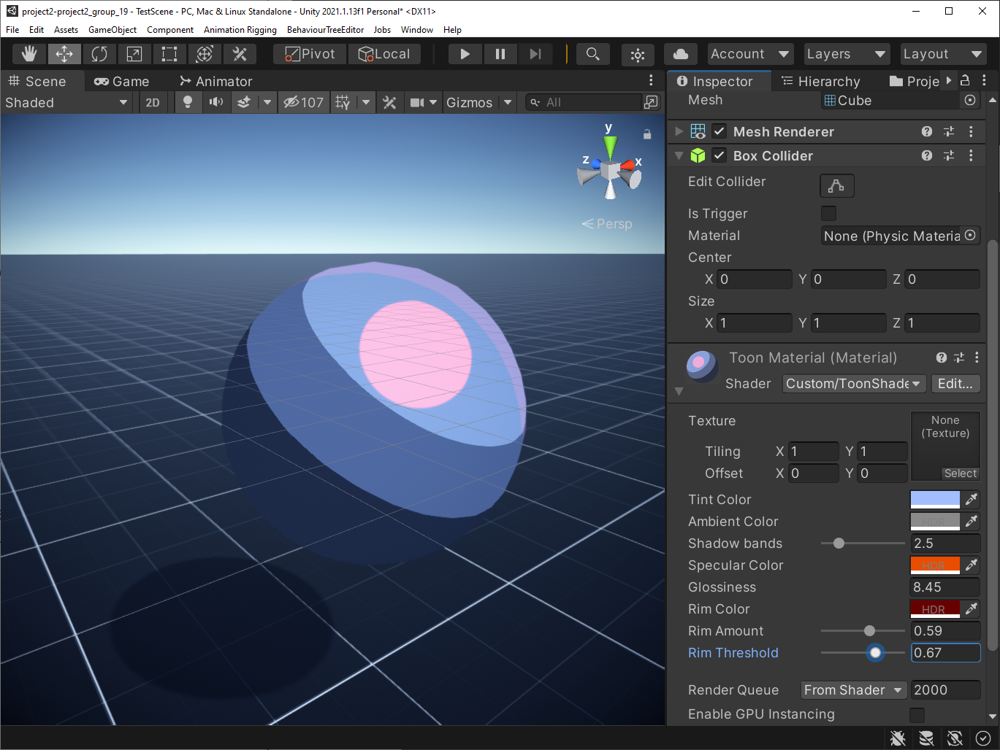

Now it looks great! But if we change the main light in the scene, our shader would still look the same. So now we need to add the main light color `_LightColor0` to the shader.

```CG
float4 light = lightIntensity * _LightColor0 + ambient;
...
float4 specular = specularIntensitySmooth * _SpecularColor * _LightColor0;
...
float4 rim = rimIntensity * _RimColor * _LightColor0;

return tex * _Tint * (light + specular + rim);
```

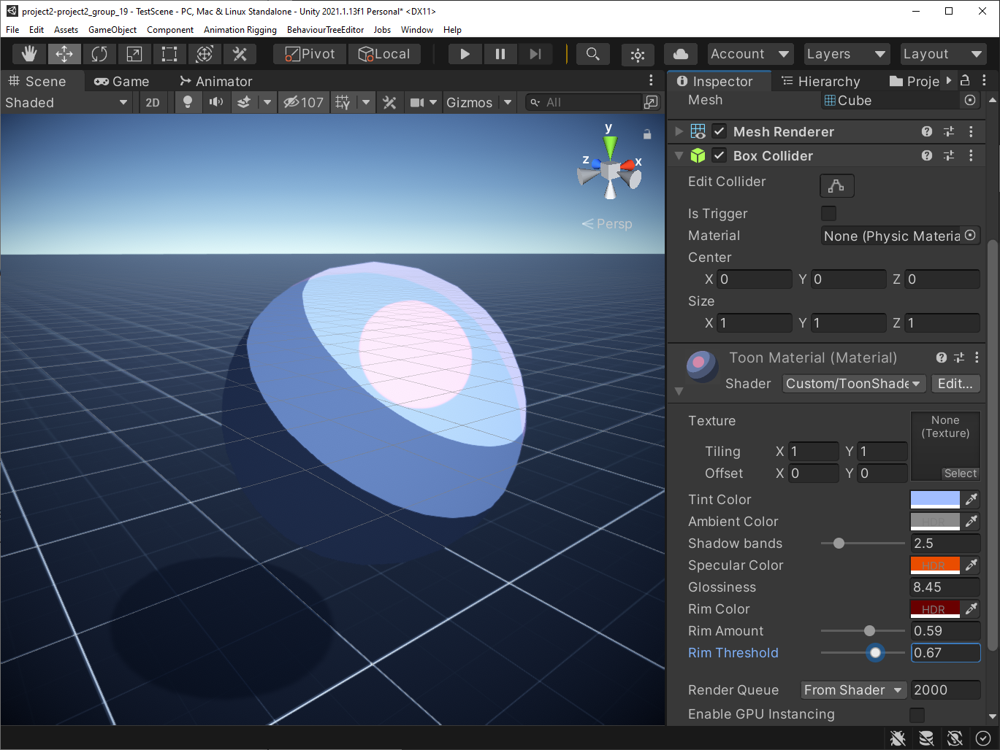

However, this only takes account of the main light (directional light) in the scene. The shader won’t be affected if we add some other point lights/spotlights.

After tons of googling, I learned that I have to add another pass to blend the other lights on top of the original color. This is done by setting the first (original) pass to `ForwardBase` and adding a second pass with the tag `ForwardAdd`. 

The content of the second pass is pretty similar to the first pass, so I won’t expand it again.

```CG
SubShader
{
    Tags {"Queue" = "Geometry" "RenderType" = "Opaque"}
    
    // pass for the directional light (main light)
    Pass
    {
    	Tags 
        { 
        	"LightMode" = "ForwardBase"
        }
        
        ...
    }
    
    // pass for each individual light (additive)
    Pass
    {
    	Tags 
        { 
        	"LightMode" = "ForwardAdd"
        }
        Blend One One // Additively blend this pass with the previous one(s). This pass gets run once per pixel light.
        
        ...
    }
```

We can now get some good-looking lights on our shader thanks to the second pass!

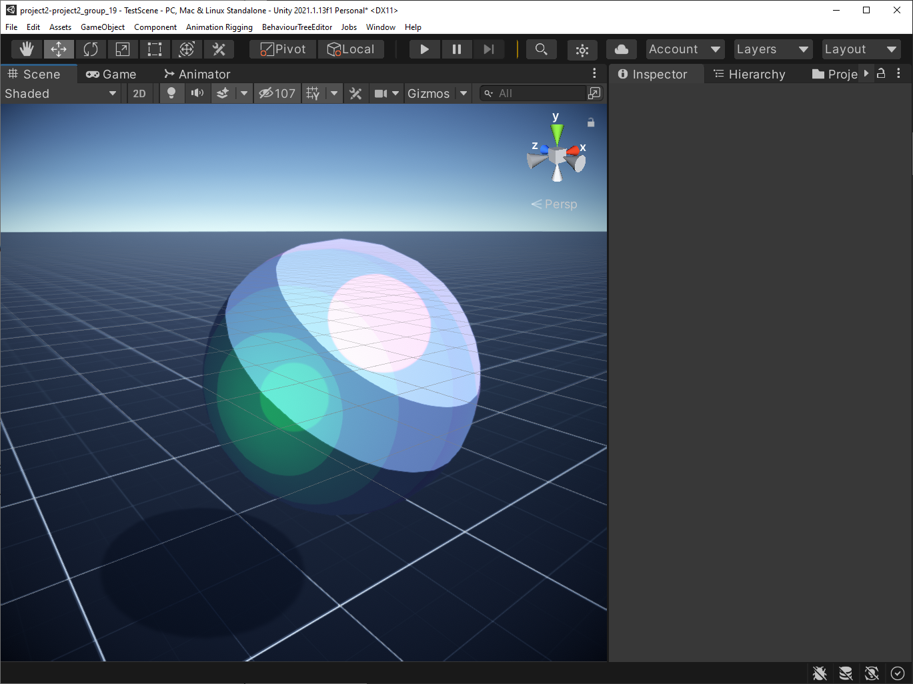

Finally, we need our shader to cast and receive shadows, like everybody else. This is done by adding `FallBack “VertexLit”` at the bottom of my shader. In my understanding, Unity would add all of the `SubShaders` inside this `VertexLit` file to my shader and use them.

P.S. I forgot to comment out this line when taking the screenshot, so all the spheres above are casting shadows on the floor.

This is how it looks like at the end:


### Shield Effect Shader

In the final stage of our boss fight, the boss would spawn a shield to prevent damage from the player. The shield looks exactly like this, but muuuuuuch bigger.

This shader is inspired by this YouTube tutorial [Unity VFX Graph - Shield Effect Tutorial - YouTube](https://www.youtube.com/watch?v=IZAzckJaSO8).

However, in that tutorial, the effect is created using shader graph, which is not supported by the Unity built-in render pipeline. 

So I followed the logic and tried to create a similar shader by hand. 


***File Location:*** `Assets/Shaders/ShieldShader`

To create this shield effect, first, we need a shield mesh.

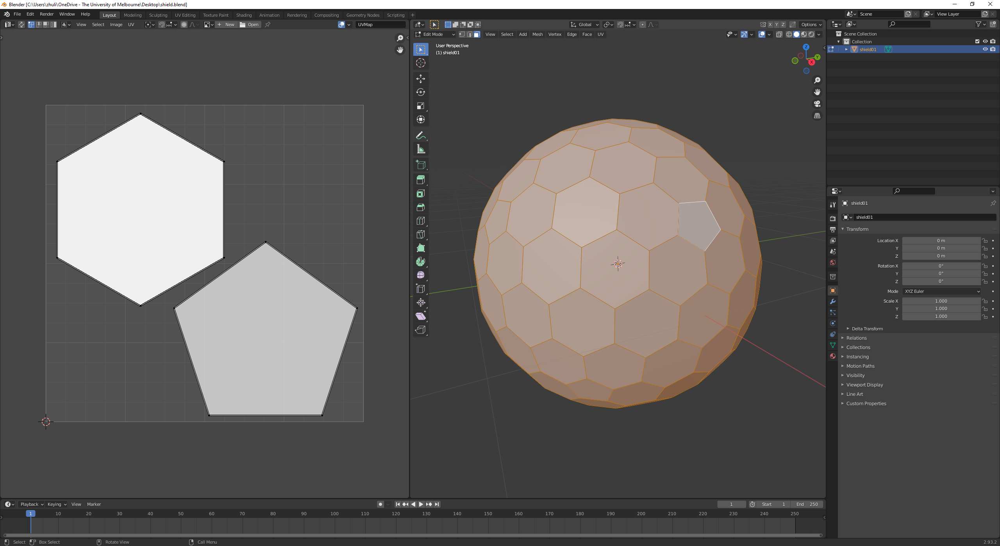

Next, create a fresh unlit shader. This time we need it to be transparent.

```CG
Tags 
{ 
	"RenderType"="Transparent" 
	"IgnoreProjector"="True" 
	"Queue"="Transparent" 
}
```

We want to have different colors on the front and the back of the faces, so we need 2 passes. One is to draw the front face, and the other one is to draw the back faces. In the end, we need to blend these two passes together. The setup looks something like this:

```CG
SubShader
{
	Tags { ... }
	LOD 100
	Blend SrcAlpha OneMinusSrcAlpha
	ZWrite Off
	
	// only render the front faces
	Pass
	{
		Cull Back
		...
	}
	
	// only render the back faces
	Pass
	{
		Cull Front
		...
	}
```

The second pass is very similar to the first pass, so I will just briefly talk about the first pass. 

First, throw the texture onto the mesh and multiply it with the desired color.

```CG
_MainTex ("Texture", 2D) = "white" {}
[HDR]
_FrontColor ("Front Color", Color) = (1,1,1,1)
[HDR]
_BackColor ("Back Color", Color) = (1,1,1,1)

...

fixed4 col = tex2D(_MainTex, i.uv);
col *= _FrontColor; // col *= _BackColor;

return col;
```


This is too bright. Also, I don’t want the back faces to be very noticeable. So the dot product, once again, comes in handy. 

I only want the back faces to be visible at the edges, so I add 1 to the dot product between the face normal and the view direction. I then divide the value by 2 so the end result lies between 0 ~ 1.

```CG
float3 normal = normalize(i.worldNormal);
float3 viewDir = normalize(i.viewDir);
float NdotV = dot(normal, viewDir);
float intensity = saturate((NdotV + 1) / 2);

return col * intensity;
```

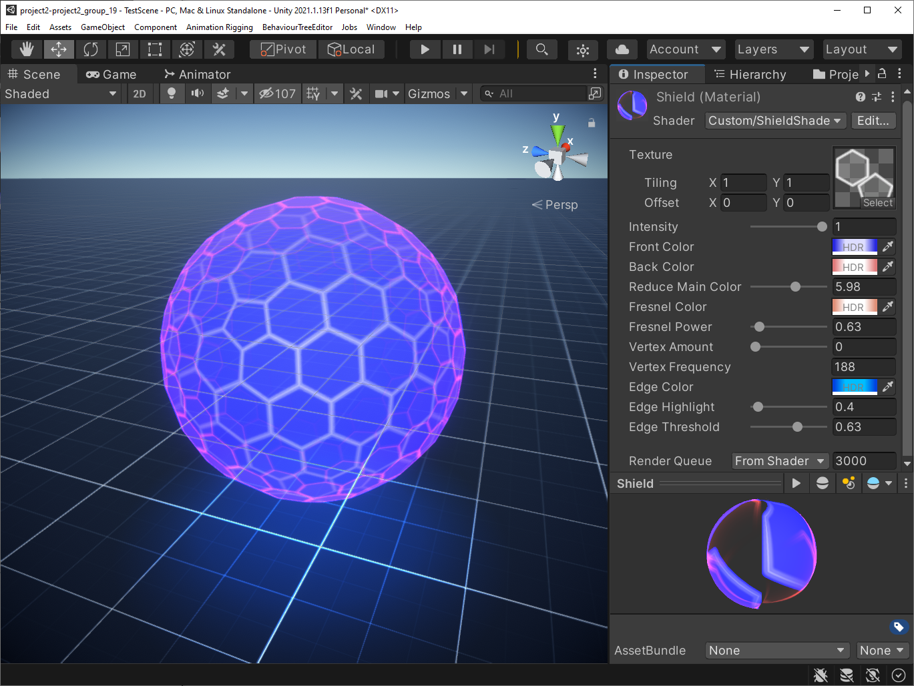

To highlight the edges of each tile, it’s actually pretty simple with the texture we prepared earlier. We first check if the alpha channel of the texture is greater than some threshold. If it is greater, we multiply it by some edge color and then add it to the output.

```CG
[HDR]
_EdgeColor ("Edge Color", Color) = (1,1,1,1)
_EdgeHighlight("Edge Highlight", Range(0, 10)) = 1
_EdgeThreshold("Edge Threshold", Range(0, 1)) = 1

...

float edge = col.a > _EdgeThreshold ? 1 : 0;
return col * intensity + edge * _EdgeHighlight * _EdgeColor;
```

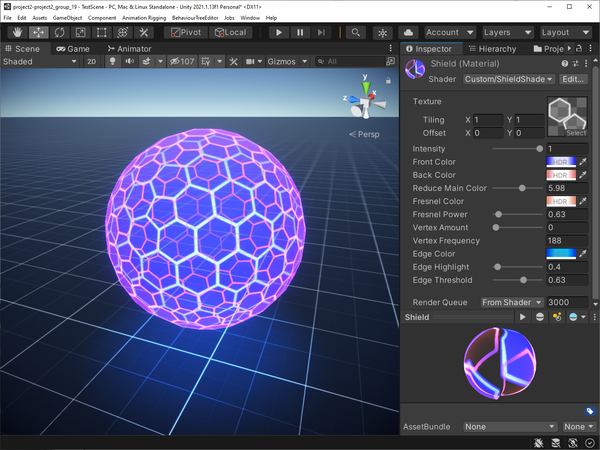

Next is to create some fresnel effect around the edge of the sphere.

This is very similar to the rim effect in the toon shader. We first calculate the dot product between the face normal and the view direction, and then subtract it from 1.

However, after adding the fresnel effect, our shader becomes too bright, so I also added a float variable `_ReduceMainCol` to reduce the original color intensity.

```CG
_ReduceMainCol("Reduce Main Color", Range(0, 10)) = 2
[HDR]
_FresnelColor ("Fresnel Color", Color) = (1,1,1,1)
_FresnelPower("Fresnel Power", Range(0, 10)) = 2

...

float4 fresnelDot = 1 - NdotV;
float4 fresnel = _FresnelColor * fresnelDot * _FresnelPower;

return col * intensity * pow(NdotV, _ReduceMainCol) + (edge * _EdgeHighlight * _EdgeColor) + fresnel
```

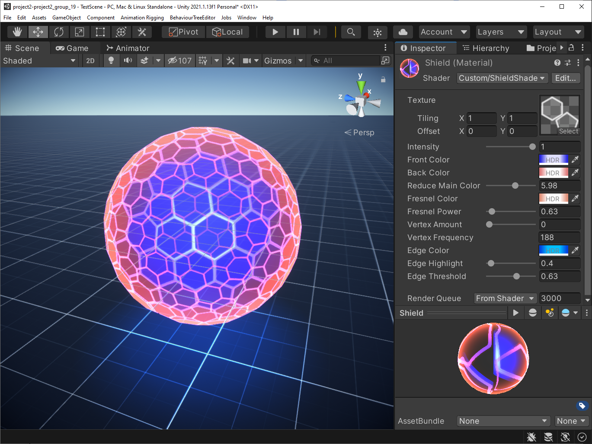

Now it looks great! 

Here comes the fun part, the floating tiles.

We need to offset the tiles along its normal. To achieve this, we need to do some fancy math inside the vertex shader. (BTW everything above is in the fragment shader.)

First, we multiply the face normal by some `_VertexAmount`. Second, to animate the up-and-down, we can use sin() along with the time passed.

```CG
_VertexAmount ("Vertex Amount", Range(0, 1)) = .1
_VertexFrequency("Vertex Frequency", Float) = 1

...

v2f vert (appdata v)
{
	float4 vertex = v.vertex;
	float4 amount = sin(_Time.x * _VertexFrequency) + 1;
	vertex += float4(v.normal, 1) * _VertexAmount * amount;
	o.vertex = UnityObjectToClipPos(vertex);
	...
}
```

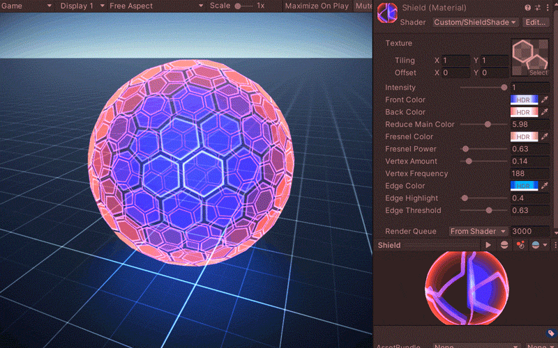

Nice.

But we want individual tiles to float separately. 

My solution is to multiply the frequency variable by a random float so that each vertex would oscillate at a different rate. But we also need to make sure that every vertex on the same tile oscillates with the same frequency.

Luckily, I found this black magic on some forum, to generate a “random” float based on a given input. Now I can simply pass in the face normal to get a “random” frequency for each tile.

```CG
// black magic
float random (float2 uv)
{
	return frac(sin(dot(uv,float2(12.9898,78.233)))*43758.5453123);
}

...

float4 amount = sin(_Time.x * _VertexFrequency * random(v.normal)) + 1;
```

This is the end result:


## Particles

In the second stage of our boss fight, the boss would shoot out a laser towards the player. 

This is the laser effect:


***File Location:*** `Assets/Particles/vfx_Charge`

***File Location:*** `Assets/Particles/vfx_Impact`

This is a composite effect containing multiple particles and also some shaders. I will only discuss the particles here since this report is getting very long...

`vfx_Charge` is the energy sphere at the start of the laser. `vfx_Impact` is the particles and decals at the end of the laser.

Since the particle section is only worth 2 marks, I won’t be explaining all the details as I did in the shader section. I will only show you how I put everything together to create this effect.

### `vfx_Charge`

This effect contains 5 sub-particles. 

The background: glowing spheres.

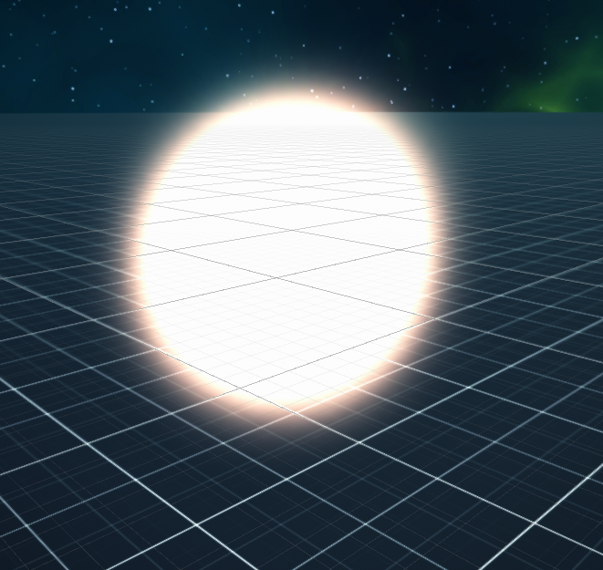

Two sparks, one narrower but longer, one fatter but shorter.

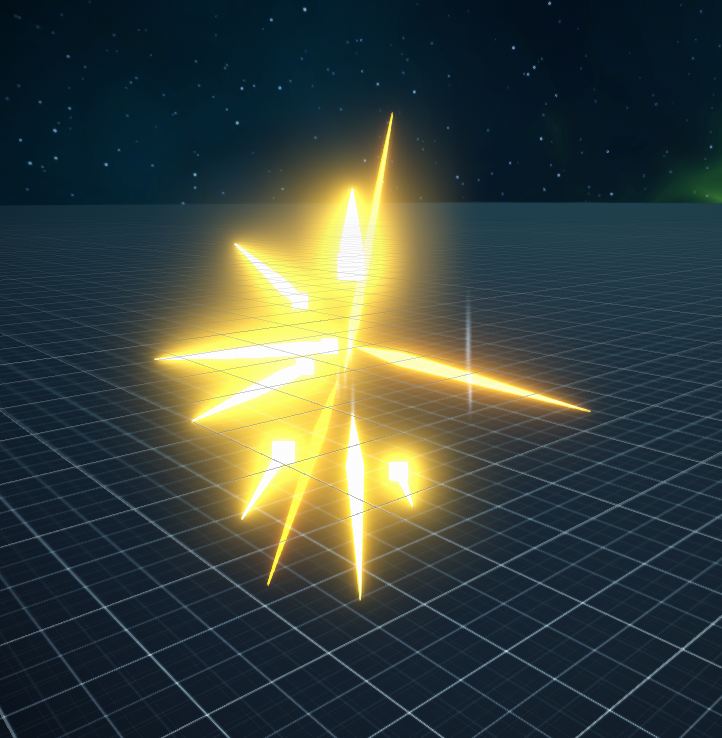

Two shockwaves, one red, one blue.

The frequencies and sizes of these two are different, to give randomness and an energetic feeling.

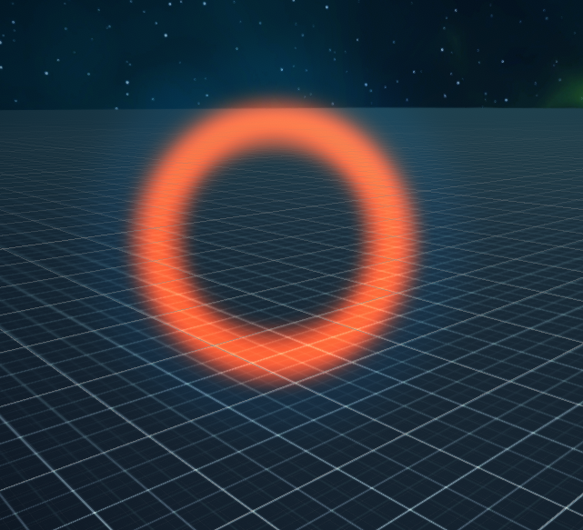

### `vfx_Impact`

This effect is simpler than the previous one. It only contains 3 different effects.

The background glowing hemisphere.

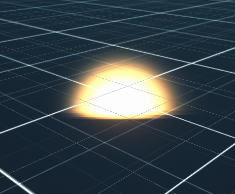

The sparks.


The decals on the floor.

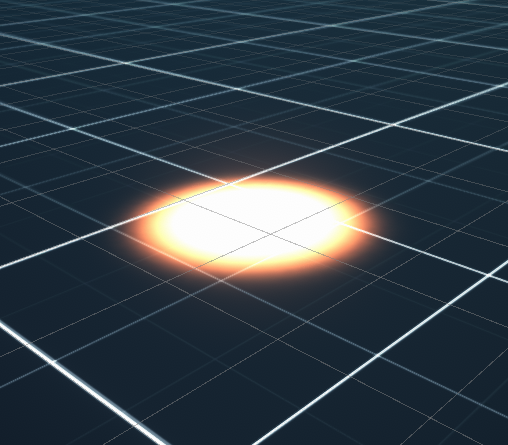


## Evaluation techniques

**Observational Methods:** Think aloud, Cooperative evaluation

It’s difficult to find the participants face to face and invite them to play.  Therefore, participants will receive our testing game and try to play the game via Zoom screen sharing.  The video will be recorded, and the participants gave feedback to the developer when they finished the game.

**Query Techniques :** Post-study questionnaire (SUS (System Usability Scale))

**Participants**:

| Name | gender | age  | identity |
| :--- | :----: | :--: | :------: |
|  Participant S  |    Male    |   22   |      ANU student    |
|  Participant G  |    Male    |   23   |     York student    |
|  Participant J  |    Male    |   22   |    McGill student   |
|  Participant W  |    Male    |   23   |     ANU student     |
|  Participant D  |    Male    |   22   |     UBC student     |
|  Participant Y  |    Male    |   22   | Uniadelaide student |
|  Participant C  |   Female   |   19   |   Flinders student  |
|  Participant C  |    Male    |   20   | Uniadelaide student |
|  Participant H  |    Male    |   42   |     Self-employ     |

### Feedback and changes

**Observational Feedbacks**

1.	There is one jump bug that will make the character move without the action
2.	Hard to get into the portal
3.	There is a screen tearing happening when moving the camera to the city because the FPS decreases from 400 to 120.
4.	No background music and death
5.	Feeling confused when getting to the final scene and do not know the target
6.	Limit of FOV and sometimes hard to aim the target.
7.	Should have a health bar to inform player about his health condition
8.	A health bar to reflect the final boss's health condition would be better
9.	Some of the objects sink into the ground
10.	A little bit hard for a newbie
11.	The typeface of the UI needs to be more clear
12.	More enemies, but less DPS from them 


**Questionnaire Feedbacks**

|      | Questions                                                    |                 1                 |  2   |             3             |    4    |  5   |
| ---- | ------------------------------------------------------------ | :-------------------------------: | :--: | :-----------------------: | :-----: | :--: |
| 1    | I would like to play this game frequently.                   |                 3                 |  5   |             3             |    4    |  4   |
| 2    | I found the game is unnecessarily complex.                   |                 4                 |  3   |             1             |    1    |  3   |
| 3    | I thought the game was easy.                                 |                 5                 |  4   |             4             |    4    |  4   |
| 4    | I think that I would need the support to be able to play this game. |                 2                 |  2   |             2             |    1    |  2   |
| 5    | I found the game was well integrated.                        |                 5                 |  5   |             4             |    5    |  4   |
| 6    | I thought there was too much inconsistency in this game.     |                 2                 |  3   |             2             |    1    |  2   |
| 7    | I would imagine that most people would learn to play this game very quickly. |                 5                 |  5   |             1             |    3    |  5   |
| 8    | I found the game very cumbersome to play.                    |                 5                 |  5   |             3             |    5    |  3   |
| 9    | I felt very confident playing this game.                     |                 5                 |  5   |             4             |    4    |  5   |
| 10   | I needed to learn a lot of things before I could play this game. |                 1                 |  2   |             1             |    1    |  2   |
|      | Any comment to our game? (Optional)                          | Perfect Design and Implementation |  /   | Enlarge FOV when shooting | Love it |  /   |
|      | SU value                                                     |               72.5                | 72.5 |           67.5            |  77.5   |  75  |
|      | Avg                                                          |                                   |      |            73             |         |      |

*Scoring:* To calculate the SUS score, first sum the score contributions from each item. Each item's score contribution will range from 0 to 4. For items 1,3,5,7, and 9 the score contribution is the scale position minus 1. For items 2,4,6,8 and 10, the contribution is 5 minus the scale position. Multiply the sum of the scores by 2.5 to obtain the overall value of SU between 0-100.

Our game’s score is 73 as shown above. According to the [website](https://usabilitygeek.com/how-to-use-the-system-usability-scale-sus-to-evaluate-the-usability-of-your-website/), our score is higher than the average SU value, which is 68. This means our game is doing ok but could use some improvements. Notice that most of the participants felt the game was cumbersome to play.

**Changes**

1.	Fixing the jump bug and map bugs
2.	The player can now jump higher to get into the portal
3.	Limit the FPS to 120 and change the camera scripts to make the game run smoothly
4.	Add background music and some sound effects
5.	Reload the level when the player is dead
6.	Add some guidance to beat the final boss
7.	Improve the health feedback for the player
8.	Add health bar to reflect the current health of the final boss
9.	Add gameplay method in the options menu
10.	UI improvements and bugs fixing
11.	Polish enemies positions
12.	Add Victory screen at the end of the game
13.	Polish mission progress
14.	Polish movements of the player
15.	Adjust the difficulty of the game

There are also more personal suggestions such as the need for more weapons, the HP, changing the shape of the guide, and adding checkpoints.


## References

**Shaders and Particles**

- [Writing Multi-Light Pixel Shaders in Unity](http://kylehalladay.com/blog/tutorial/bestof/2013/10/13/Multi-Light-Diffuse.html)

- [Toon Shader](https://roystan.net/articles/toon-shader.html)

- [My take on shaders: Cel shading](https://halisavakis.com/my-take-on-shaders-cel-shading/)

- [My take on shaders: Firewatch multi-colored fog](https://halisavakis.com/my-take-on-shaders-firewatch-multi-colored-fog/)

- [Unity VFX Graph - Shield Effect Tutorial - YouTube](https://www.youtube.com/watch?v=IZAzckJaSO8)

- [Unity VFX Graph - Muzzle Flash Effect Tutorial - YouTube](https://www.youtube.com/watch?v=sgBbnF3r60U&t=617s)

- [Unity Shader Graph - Laser Beam Tutorial - YouTube](https://www.youtube.com/watch?v=mGd3nYXj1Oc)

- [[Unity\] How to make a stylized/cartoony explosion - YouTube](https://www.youtube.com/watch?v=lw4T8gfcKZ0)

**AI**

- [Unity | Create Behaviour Trees using UI Builder, GraphView, and Scriptable Objects - YouTube](https://www.youtube.com/watch?v=nKpM98I7PeM&t=1s)

**Procedural generation**

- [PERLIN NOISE in Unity - YouTube](https://youtu.be/bG0uEXV6aHQ)
- [Procedural Spawning With Raycasts - YouTube](https://youtu.be/U8_p-DofWvg)
- [Lowpoly Mesh - GitHub](https://github.com/Syomus/ProceduralToolkit)

**SUS questionare**

- [SUS: A Quick and Dirty Usability Scale](http://www.usabilitynet.org/trump/documents/Suschapt.doc) by John Brooke (1986)

